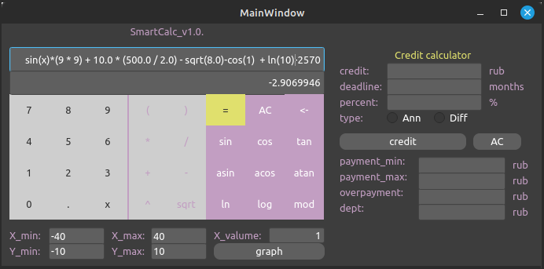

# SmartCalc v1.0

Implementation of SmartCalc v1.0.

In this project you will implement an extended version of the usual calculator, in the C/С++ programming language. In addition to basic arithmetic operations such as add/subtract and multiply/divide, you need to supplement the calculator with the ability to calculate arithmetic expressions by following the order, as well as some mathematical functions (sine, cosine, logarithm, etc.).
Besides calculating expressions, it should also support the use of the _x_ variable and the graphing of the corresponding function.
As for other improvements you can consider a credit.

- **Arithmetic operators**:

  | Operator name  | Infix notation   (Classic) | Prefix notation   (Polish notation) | Postfix notation   (Reverse Polish notation) |
  | -------------- | ------------------------------- | ---------------------------------------- | ------------------------------------------------- |
  | Brackets       | (a + b)                         | (+ a b)                                  | a b +                                             |
  | Addition       | a + b                           | + a b                                    | a b +                                             |
  | Subtraction    | a - b                           | - a b                                    | a b -                                             |
  | Multiplication | a \* b                          | \* a b                                   | a b \*                                            |
  | Division       | a / b                           | / a b                                    | a b \                                             |
  | Power          | a ^ b                           | ^ a b                                    | a b ^                                             |
  | Modulus        | a mod b                         | mod a b                                  | a b mod                                           |
  | Unary plus     | +a                              | +a                                       | a+                                                |
  | Unary minus    | -a                              | -a                                       | a-                                                |

  > Note that the multiplication operator contains the obligatory sign `*`. Processing an expression with the omitted `*` sign is optional and is left to the developer's decision

- **Functions**:

  | Function description       | Function |
  | -------------------------- | -------- |
  | Computes cosine            | cos(x)   |
  | Computes sine              | sin(x)   |
  | Computes tangent           | tan(x)   |
  | Computes arc cosine        | acos(x)  |
  | Computes arc sine          | asin(x)  |
  | Computes arc tangent       | atan(x)  |
  | Computes square root       | sqrt(x)  |
  | Computes natural logarithm | ln(x)    |
  | Computes common logarithm  | log(x)   |

## Credit calculator

Provide a special mode "credit calculator" (you can take banki.ru and calcus.ru as an example):

- Input: total credit amount, term, interest rate, type (annuity, differentiated)
- Output: monthly payment, overpayment on credit, total payment
