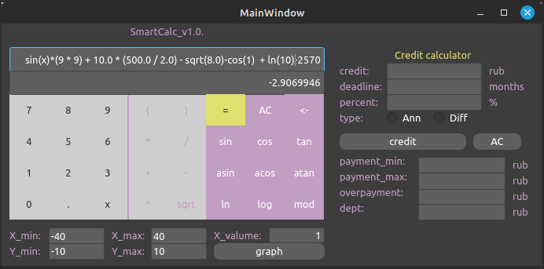

# SmartCalc

Реализация SmartCalc

В данных проектах реализован на языке программирования С/С++ расширенная версию обычного калькулятора, который можно найти в стандартных приложениях каждой операционной системы. Помимо базовых арифметических операций, как плюс-минус и умножить-поделить, необходимо дополнить калькулятор возможностью вычисления арифметических выражений с учетом приоритетов, а так же некоторыми математическими функциями (синус, косинус, логарифм и т.д.). Помимо вычисления выражений калькулятор так же должен поддерживать использование переменной _x_ и построение графика соответствующей функции. В качестве дополнительных улучшений можно будет рассмотреть кредитный калькулятор.

- **Арифметические операторы**:

  | Название оператора   | Инфиксная нотация   (Классическая) | Префиксная нотация   (Польская нотация) | Постфиксная нотация   (Обратная польская нотация) |
  | -------------------- | --------------------------------------- | -------------------------------------------- | ------------------------------------------------------ |
  | Скобки               | (a + b)                                 | (+ a b)                                      | a b +                                                  |
  | Сложение             | a + b                                   | + a b                                        | a b +                                                  |
  | Вычитание            | a - b                                   | - a b                                        | a b -                                                  |
  | Умножение            | a \* b                                  | \* a b                                       | a b \*                                                 |
  | Деление              | a / b                                   | / a b                                        | a b \                                                  |
  | Возведение в степень | a ^ b                                   | ^ a b                                        | a b ^                                                  |
  | Остаток от деления   | a mod b                                 | mod a b                                      | a b mod                                                |
  | Унарный плюс         | +a                                      | +a                                           | a+                                                     |
  | Унарный минус        | -a                                      | -a                                           | a-                                                     |

  > Обратите внимание, что оператор умножения содержит обязательный знак `*`. Обработка выражения с опущенным знаком `*` является необязательной и остается на усмотрение разработчика

- **Функции**:

  | Описание функции               | Функция |
  | ------------------------------ | ------- |
  | Вычисляет косинус              | cos(x)  |
  | Вычисляет синус                | sin(x)  |
  | Вычисляет тангенс              | tan(x)  |
  | Вычисляет арккосинус           | acos(x) |
  | Вычисляет арксинус             | asin(x) |
  | Вычисляет арктангенс           | atan(x) |
  | Вычисляет квадратный корень    | sqrt(x) |
  | Вычисляет натуральный логарифм | ln(x)   |
  | Вычисляет десятичный логарифм  | log(x)  |

## Кредитный калькулятор

Предусмотреть специальный режим "кредитный калькулятор" (за образец можно взять сайты banki.ru и calcus.ru):

- Вход: общая сумма кредита, срок, процентная ставка, тип (аннуитетный, дифференцированный)
- Выход: ежемесячный платеж, переплата по кредиту, общая выплата
